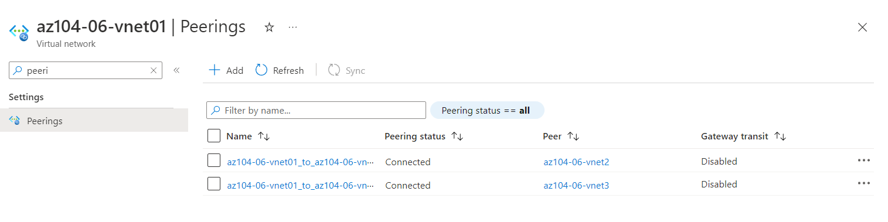
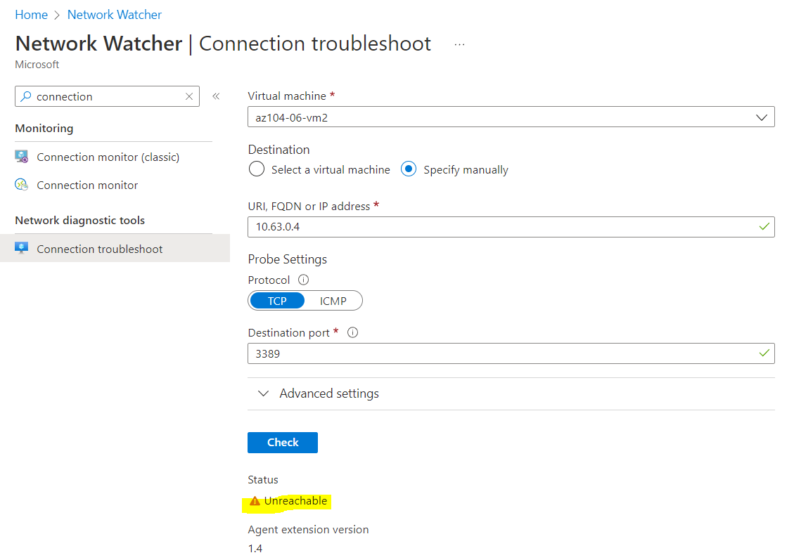
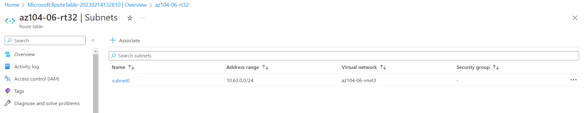
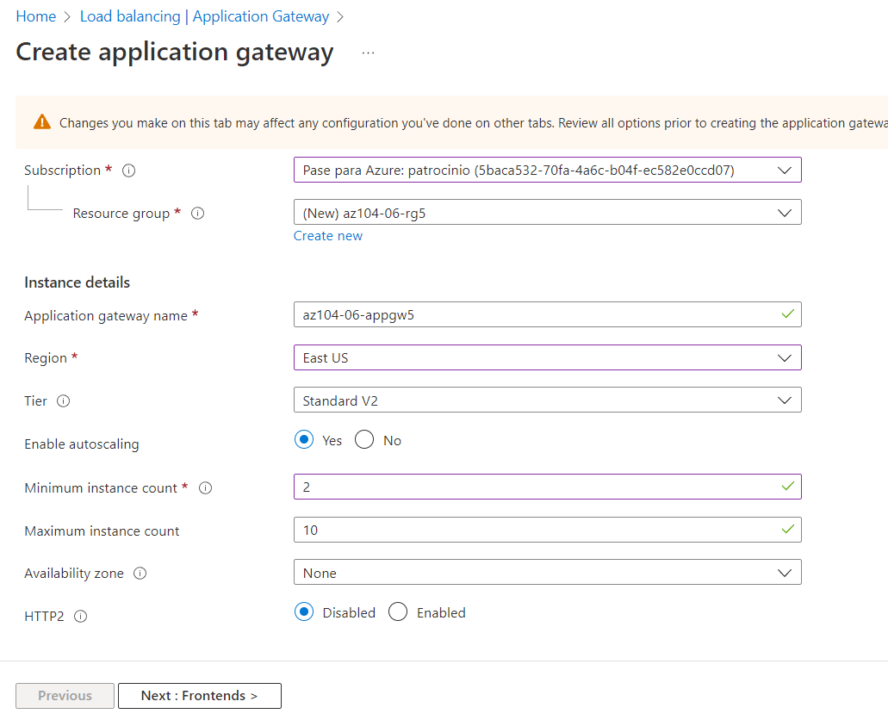

# Laboratorio 06 - Implementar la gestión del tráfico

Se le asignó la tarea de probar la administración del tráfico de red dirigido a las máquinas virtuales de Azure en la topología de red central y radial, que Contoso considera implementar en su entorno de Azure (en lugar de crear la topología de malla, que probó en el laboratorio anterior). Esta prueba debe incluir la implementación de la conectividad entre los radios basándose en rutas definidas por el usuario que obligan al tráfico a fluir a través del concentrador, así como la distribución del tráfico entre máquinas virtuales mediante el uso de balanceadores de carga de capa 4 y capa 7. Para este propósito, pretende usar Azure Load Balancer (capa 4) y Azure Application Gateway (capa 7).

**Nota:** Hay disponible una simulación de laboratorio interactiva que le permite hacer clic en este laboratorio a su propio ritmo. Es posible que encuentre ligeras diferencias entre la simulación interactiva y el laboratorio alojado, pero los conceptos e ideas centrales que se demuestran son los mismos.

**Nota :** este laboratorio, de forma predeterminada, requiere un total de 8 vCPU disponibles en la serie Standard_Dsv3 en la región que elija para la implementación, ya que implica la implementación de cuatro máquinas virtuales de Azure de SKU Standard_D2s_v3. Si sus estudiantes usan cuentas de prueba, con el límite de 4 vCPU, puede usar un tamaño de VM que requiera solo una vCPU (como Standard_B1s).

## Objetivos
En este laboratorio, usted:

- Tarea 1: Aprovisionar el entorno de laboratorio
- Tarea 2: configurar la topología de red de concentrador y radio
- Tarea 3: Probar la transitividad del emparejamiento de redes virtuales
- Tarea 4: configurar el enrutamiento en la topología de concentrador y radio
- Tarea 5: Implementar Azure Load Balancer
- Tarea 6: Implementar Azure Application Gateway

## Tiempo estimado: 60 minutos
## Diagrama de arquitectura


## Instrucciones
### Ejercicio 1
### Tarea 1: Aprovisionar el entorno de laboratorio
En esta tarea, implementará cuatro máquinas virtuales en la misma región de Azure. Los dos primeros residirán en una red virtual central, mientras que cada uno de los dos restantes residirá en una red virtual radial independiente.

1. Inicie sesión en el portal de Azure .

2. En Azure Portal, abra Azure Cloud Shell haciendo clic en el icono en la parte superior derecha de Azure Portal.

3. Si se le solicita que seleccione Bash o PowerShell , seleccione PowerShell .

**Nota :** si es la primera vez que inicia Cloud Shell y aparece el mensaje No tiene almacenamiento montado , seleccione la suscripción que está usando en este laboratorio y haga clic en Crear almacenamiento .

4. En la barra de herramientas del panel de Cloud Shell, haga clic en el ícono Cargar/Descargar archivos , en el menú desplegable, haga clic en Cargar y cargue los archivos \Allfiles\Labs\06\az104-06-vms-loop-template.json y \ Allfiles\Labs\06\az104-06-vms-loop-parameters.json en el directorio principal de Cloud Shell.

5. Edite el archivo de parámetros que acaba de cargar y cambie la contraseña. Si necesita ayuda para editar el archivo en el Shell, solicite ayuda a su instructor. Como práctica recomendada, los secretos, como las contraseñas, deben almacenarse de forma más segura en Key Vault.

6. Desde el panel de Cloud Shell, ejecute lo siguiente para crear el primer grupo de recursos que hospedará el entorno de laboratorio (reemplace el marcador de posición '[Azure_region]' con el nombre de una región de Azure en la que pretende implementar máquinas virtuales de Azure) (puede utilice el cmdlet “(Get-AzLocation).Location” para obtener la lista de regiones):

```
 $location = '[Azure_region]'
 ```

Ahora el nombre del grupo de recursos:
```
 $rgName = 'az104-06-rg1'
```

Y finalmente cree el grupo de recursos en la ubicación deseada:
```
 New-AzResourceGroup -Name $rgName -Location $location
 ```

7. Desde el panel de Cloud Shell, ejecute lo siguiente para crear las tres redes virtuales y las cuatro máquinas virtuales de Azure en ellas usando la plantilla y los archivos de parámetros que cargó:

```
New-AzResourceGroupDeployment `
   -ResourceGroupName $rgName `
   -TemplateFile $HOME/az104-06-vms-loop-template.json `
   -TemplateParameterFile $HOME/az104-06-vms-loop-parameters.json
```

**Nota :** Espere a que se complete la implementación antes de continuar con el siguiente paso. Esto debería tomar alrededor de 5 minutos.

**Nota :** si recibe un error que indica que el tamaño de la VM no está disponible, solicite ayuda a su instructor e intente estos pasos.

a. Haga clic en el ```{}``` botón en su CloudShell, seleccione az104-06-vms-loop-parameters.json en la barra lateral izquierda y tome nota del ```vmSize``` valor del parámetro.

b. Compruebe la ubicación en la que está implementado el grupo de recursos 'az104-06-rg1'. Puede ejecutar ```az group show -n az104-06-rg1 --query location``` en su CloudShell para obtenerlo.

c. Ejecutar ```az vm list-skus --location <Replace with your location> -o table --query "[? contains(name,'Standard_D2s')].name"``` en su CloudShell.

d. Reemplace el valor del ```vmSize``` parámetro con uno de los valores devueltos por el comando que acaba de ejecutar. Si no se devuelven valores, es posible que deba elegir una región diferente para implementar. También puede elegir un apellido diferente, como "Standard_B1s".

e. Ahora vuelva a implementar sus plantillas ejecutando el ```New-AzResourceGroupDeployment``` comando nuevamente. Puede presionar el botón arriba varias veces, lo que traería el último comando ejecutado.

8. Desde el panel de Cloud Shell, ejecute lo siguiente para instalar la extensión Network Watcher en las máquinas virtuales de Azure implementadas en el paso anterior:

```
$rgName = 'az104-06-rg1'
$location = (Get-AzResourceGroup -ResourceGroupName $rgName).location
$vmNames = (Get-AzVM -ResourceGroupName $rgName).Name

foreach ($vmName in $vmNames) {
  Set-AzVMExtension `
  -ResourceGroupName $rgName `
  -Location $location `
  -VMName $vmName `
  -Name 'networkWatcherAgent' `
  -Publisher 'Microsoft.Azure.NetworkWatcher' `
  -Type 'NetworkWatcherAgentWindows' `
  -TypeHandlerVersion '1.4'
}
```


**Nota :** Espere a que se complete la implementación antes de continuar con el siguiente paso. Esto debería tomar alrededor de 5 minutos.

9. Cierre el panel de Cloud Shell.

### Tarea 2: configurar la topología de red de concentrador y radio
En esta tarea, configurará el emparejamiento local entre las redes virtuales que implementó en las tareas anteriores para crear una topología de red radial.

1. En Azure Portal, busque y seleccione Redes virtuales .

2. Revise las redes virtuales que creó en la tarea anterior.

**Nota :** la plantilla que usó para la implementación de las tres redes virtuales garantiza que los intervalos de direcciones IP de las tres redes virtuales no se superpongan.

3. En la lista de redes virtuales, seleccione az104-06-vnet2 .

4. En la hoja az104-06-vnet2 , seleccione Propiedades .

5. En el az104-06-vnet2 | Hoja de propiedades , registre el valor de la propiedad ID de recurso .


6. Vuelva a navegar a la lista de redes virtuales y seleccione az104-06-vnet3 .

7. En la hoja az104-06-vnet3 , seleccione Propiedades .

8. En el az104-06-vnet3 | Hoja de propiedades , registre el valor de la propiedad ID de recurso .

**Nota :** necesitará los valores de la propiedad ResourceID para ambas redes virtuales más adelante en esta tarea.


**Nota :** Esta es una solución alternativa que soluciona el problema con Azure Portal que ocasionalmente no muestra la red virtual recién aprovisionada al crear emparejamientos de redes virtuales.

9. En la lista de redes virtuales, haga clic en az104-06-vnet01 .

10. En la hoja de red virtual az104-06-vnet01 , en la sección Configuración , haga clic en Emparejamientos y luego haga clic en + Agregar .

11. Agregue un emparejamiento con la siguiente configuración (deje los demás con sus valores predeterminados) y haga clic en Agregar :

| Configuración | Valor |
| -- | -- |
| Esta red virtual: nombre del enlace de emparejamiento	| az104-06-vnet01_to_az104-06-vnet2 |
| Tráfico a la red virtual remota |	Permitir (predeterminado) |
| Tráfico reenviado desde una red virtual remota |	Bloquear el tráfico que se origina fuera de esta red virtual |
| Puerta de enlace de red virtual |	Ninguno (predeterminado) |
| Red virtual remota: nombre del enlace de emparejamiento |	az104-06-vnet2_to_az104-06-vnet01 |
| Modelo de implementación de red virtual | Administrador de recursos |
| Sé mi ID de recurso |	activado |
| ID de recurso	| el valor del parámetro resourceID de az104-06-vnet2 que registró anteriormente en esta tarea |
| Tráfico a la red virtual remota |	Permitir (predeterminado) |
| Tráfico reenviado desde una red virtual remota |	Permitir (predeterminado) |
| Puerta de enlace de red virtual | Ninguno (predeterminado) |
| | |


**Nota :** Espere a que se complete la operación.

**Nota :** este paso establece dos emparejamientos locales: uno de az104-06-vnet01 a az104-06-vnet2 y el otro de az104-06-vnet2 a az104-06-vnet01.

**Nota :** Permitir el tráfico reenviado debe estar habilitado para facilitar el enrutamiento entre redes virtuales radiales, que implementará más adelante en este laboratorio.

12. En la hoja de red virtual az104-06-vnet01 , en la sección Configuración , haga clic en Emparejamientos y luego haga clic en + Agregar .

13. Agregue un emparejamiento con la siguiente configuración (deje los demás con sus valores predeterminados) y haga clic en Agregar :

| Configuración | Valor |
| -- | -- |
| Esta red virtual: nombre del enlace de emparejamiento	| az104-06-vnet01_to_az104-06-vnet3 |
| Tráfico a la red virtual remota |	Permitir (predeterminado) |
| Tráfico reenviado desde una red virtual remota |	Bloquear el tráfico que se origina fuera de esta red virtual |
| Puerta de enlace de red virtual |	Ninguno (predeterminado) |
| Red virtual remota: nombre del enlace de emparejamiento |	az104-06-vnet3_to_az104-06-vnet01 |
| Modelo de implementación de red virtual | Administrador de recursos |
| Sé mi ID de recurso |	activado |
| ID de recurso	| el valor del parámetro resourceID de az104-06-vnet2 que registró anteriormente en esta tarea |
| Tráfico a la red virtual remota |	Permitir (predeterminado) |
| Tráfico reenviado desde una red virtual remota |	Permitir (predeterminado) |
| Puerta de enlace de red virtual | Ninguno (predeterminado) |
| | |


**Nota :** este paso establece dos emparejamientos locales: uno de az104-06-vnet01 a az104-06-vnet3 y el otro de az104-06-vnet3 a az104-06-vnet01. Esto completa la configuración de la topología de concentrador y radio (con redes virtuales de dos radios).

**Nota :** Permitir el tráfico reenviado debe estar habilitado para facilitar el enrutamiento entre redes virtuales radiales, que implementará más adelante en este laboratorio.



### Tarea 3: Probar la transitividad del emparejamiento de redes virtuales
En esta tarea, probará la transitividad del emparejamiento de redes virtuales mediante Network Watcher.

1. En Azure Portal, busque y seleccione Network Watcher .

2. En la hoja de Network Watcher , expanda la lista de regiones de Azure y verifique que el servicio esté habilitado en la región que está utilizando.

3. En la hoja de Network Watcher , vaya a Solución de problemas de conexión .

4. En Network Watcher - Hoja de solución de problemas de conexión, inicie una verificación con las siguientes configuraciones (deje otras con sus valores predeterminados):

**Nota :** Es posible que el grupo de recursos tarde unos minutos en aparecer en la lista. Si no quiere esperar, intente esto: elimine Network Watcher, cree un nuevo Network Watcher y luego vuelva a intentar la solución de problemas de conexión.

| Configuración	| Valor |
| -- | -- |
| Suscripción |	el nombre de la suscripción de Azure que está utilizando en este laboratorio |
| grupo de recursos |	az104-06-rg1 |
| Tipo de fuente |	Máquina virtual |
| Máquina virtual |	az104-06-vm0 |
| Destino |	Especificar manualmente |
| URI, FQDN o IPv4	| 10.62.0.4 |
| Protocolo | TCP |
| Puerto de destino | 3389 |
| | |

**Nota :** 10.62.0.4 representa la dirección IP privada de az104-06-vm2


5. Haga clic en Verificar y espere hasta que se devuelvan los resultados de la verificación de conectividad. Verifique que el estado sea Accesible . Revise la ruta de la red y observe que la conexión fue directa, sin saltos intermedios entre las máquinas virtuales.

**Nota :** Esto es de esperar, ya que la red virtual central se intercambia directamente con la primera red virtual radial.

6. En Network Watcher - Hoja de solución de problemas de conexión, inicie una verificación con las siguientes configuraciones (deje otras con sus valores predeterminados):

| Configuración	| Valor |
| -- | -- |
| Suscripción	| el nombre de la suscripción de Azure que está utilizando en este laboratorio |
| grupo de recursos	| az104-06-rg1 |
| Tipo de fuente |	Máquina virtual |
| Máquina virtual |	az104-06-vm0 |
| Destino	| Especificar manualmente |
| URI, FQDN o IPv4	| 10.63.0.4 |
| Protocolo |	TCP |
| Puerto de destino |	3389 |
| | |

**Nota :** 10.63.0.4 representa la dirección IP privada de az104-06-vm3


7. Haga clic en Verificar y espere hasta que se devuelvan los resultados de la verificación de conectividad. Verifique que el estado sea Accesible . Revise la ruta de la red y observe que la conexión fue directa, sin saltos intermedios entre las máquinas virtuales.

**Nota :** Esto es de esperar, ya que la red virtual central se interconecta directamente con la segunda red virtual radial.

8. En Network Watcher - Hoja de solución de problemas de conexión, inicie una verificación con las siguientes configuraciones (deje otras con sus valores predeterminados):

| Configuración	| Valor |
| -- | -- |
| Suscripción	| el nombre de la suscripción de Azure que está utilizando en este laboratorio |
| grupo de recursos	| az104-06-rg1 |
| Tipo de fuente |	Máquina virtual |
| Máquina virtual |	az104-06-vm2 |
| Destino	| Especificar manualmente |
| URI, FQDN o IPv4	| 10.63.0.4 |
| Protocolo |	TCP |
| Puerto de destino |	3389 |
| | |

9. Haga clic en Verificar y espere hasta que se devuelvan los resultados de la verificación de conectividad. Tenga en cuenta que el estado es Inalcanzable .



**Nota :** Esto es de esperar, ya que las redes virtuales de dos radios no se emparejan entre sí (el emparejamiento de redes virtuales no es transitivo).

### Tarea 4: configurar el enrutamiento en la topología de concentrador y radio
En esta tarea, configurará y probará el enrutamiento entre las redes virtuales de dos radios habilitando el reenvío de IP en la interfaz de red de la máquina virtual az104-06-vm0 , habilitando el enrutamiento dentro de su sistema operativo y configurando rutas definidas por el usuario en el radio. red virtual

1. En Azure Portal, busque y seleccione Máquinas virtuales .

2. En la hoja Máquinas virtuales , en la lista de máquinas virtuales, haga clic en az104-06-vm0 .

3. En el blade de máquina virtual az104-06-vm0 , en la sección Configuración , haga clic en Redes .

4. Haga clic en el vínculo az104-06-nic0 junto a la etiqueta de la interfaz de red y luego, en la hoja de la interfaz de red az104-06-nic0 , en la sección Configuración , haga clic en Configuraciones de IP .

5. Establezca el reenvío de IP en Habilitado y guarde el cambio.


**Nota :** esta configuración es necesaria para que az104-06-vm0 funcione como un enrutador, que enrutará el tráfico entre dos redes virtuales radiales.

**Nota :** ahora debe configurar el sistema operativo de la máquina virtual az104-06-vm0 para admitir el enrutamiento.

6. En Azure Portal, vuelva a la hoja de la máquina virtual de Azure az104-06-vm0 y haga clic en Información general .

7. En la hoja az104-06-vm0 , en la sección Operaciones , haga clic en Ejecutar comando y, en la lista de comandos, haga clic en Ejecutar PowerShellScript .

8. En la hoja Ejecutar secuencia de comandos , escriba lo siguiente y haga clic en Ejecutar para instalar la función de servidor de Windows de acceso remoto.

```
Install-WindowsFeature RemoteAccess -IncludeManagementTools
```


**Nota :** Espere la confirmación de que el comando se completó con éxito.

9. En la hoja Ejecutar secuencia de comandos , escriba lo siguiente y haga clic en Ejecutar para instalar el servicio de función de enrutamiento.

```
Install-WindowsFeature -Name Routing -IncludeManagementTools -IncludeAllSubFeature

Install-WindowsFeature -Name "RSAT-RemoteAccess-Powershell"

Install-RemoteAccess -VpnType RoutingOnly

Get-NetAdapter | Set-NetIPInterface -Forwarding Enabled
```


**Nota :** Espere la confirmación de que el comando se completó con éxito.

**Nota :** ahora debe crear y configurar rutas definidas por el usuario en las redes virtuales radiales.

10. En Azure Portal, busque y seleccione Tablas de rutas y, en la hoja Tablas de rutas , haga clic en + Crear .

11. Cree una tabla de rutas con la siguiente configuración (deje las demás con sus valores predeterminados):

| Configuración | Valor |
| -- | -- |
| Suscripción |	el nombre de la suscripción de Azure que está utilizando en este laboratorio |
| grupo de recursos | az104-06-rg1 |
| Ubicación | el nombre de la región de Azure en la que creó las redes virtuales |
| Nombre |	az104-06-rt23 |
| Propagación de rutas de puerta de enlace | No |
| | |


12. Haga clic en Revisar y crear . Deje que se produzca la validación y haga clic en Crear para enviar su implementación.

**Nota :** Espere a que se cree la tabla de rutas. Esto debería tomar alrededor de 3 minutos.

13. Haga clic en Ir al recurso .

14. En la hoja de la tabla de rutas az104-06-rt23 , en la sección Configuración , haga clic en Rutas y luego haga clic en + Agregar .

15. Agregue una nueva ruta con la siguiente configuración:

| Configuración	| Valor |
| -- | -- |
| Nombre de la ruta	| az104-06-ruta-vnet2-a-vnet3 |
| Prefijo de dirección de destino |	Direcciones IP |
| Direcciones IP de destino/intervalos CIDR	| 10.63.0.0/20 |
| Tipo de siguiente salto |	Dispositivo virtual |
| Dirección del próximo salto |	10.60.0.4 |
| | |


16. Haga clic en Agregar

17. De vuelta en la hoja de la tabla de rutas az104-06-rt23 , en la sección Configuración , haga clic en Subredes y luego haga clic en + Asociar .

18. Asocie la tabla de rutas az104-06-rt23 con la siguiente subred:

| Configuración	| Valor |
| -- | -- |
| red virtual | az104-06-vnet2 |
| subred |	subred0 |
| | |

19. Haga clic en Agregar


20. Vuelva a la hoja Tablas de rutas y haga clic en + Crear .

21. Cree una tabla de rutas con la siguiente configuración (deje las demás con sus valores predeterminados):

| Configuración | Valor |
| -- | -- |
| Suscripción |	el nombre de la suscripción de Azure que está utilizando en este laboratorio |
| grupo de recursos | az104-06-rg1 |
| Región |	el nombre de la región de Azure en la que creó las redes virtuales |
| Nombre |	az104-06-rt32 |
| Propagación de rutas de puerta de enlace | No |
| | |

22. Haga clic en Revisar y crear. Deje que se produzca la validación y pulse Crear para enviar su implementación.

**Nota :** Espere a que se cree la tabla de rutas. Esto debería tomar alrededor de 3 minutos.

23. Haga clic en Ir al recurso .

24. En la hoja de la tabla de rutas az104-06-rt32 , en la sección Configuración , haga clic en Rutas y luego haga clic en + Agregar .

25. Agregue una nueva ruta con la siguiente configuración:

| Configuración	| Valor |
| -- | -- |
| Nombre de la ruta	az104-06-ruta-vnet3-a-vnet2
Prefijo de dirección de destino	Direcciones IP
Direcciones IP de destino/intervalos CIDR	10.62.0.0/20
Tipo de siguiente salto	Dispositivo virtual
Dirección del próximo salto	10.60.0.4

26. Haga clic en Aceptar


27. De vuelta en la hoja de la tabla de rutas az104-06-rt32 , en la sección Configuración , haga clic en Subredes y luego haga clic en + Asociar .

28. Asocie la tabla de rutas az104-06-rt32 con la siguiente subred:

| Configuración |	Valor |
| -- | -- |
| red virtual |	az104-06-vnet3 |
| subred | subred0 |
| | |

29. Haga clic en Aceptar



30. En Azure Portal, vuelva a la hoja Network Watcher: solución de problemas de conexión .

31. En Network Watcher - Hoja de solución de problemas de conexión, inicie una verificación con las siguientes configuraciones (deje otras con sus valores predeterminados):

| Configuración |	Valor |
| -- | -- |
| Suscripción |	el nombre de la suscripción de Azure que está utilizando en este laboratorio |
| grupo de recursos |	az104-06-rg1 |
| Tipo de fuente |	Máquina virtual |
| Máquina virtual |	az104-06-vm2 |
| Destino |	Especificar manualmente |
| URI, FQDN o IPv4 |	10.63.0.4 |
| Protocolo |	TCP |
| Puerto de destino |	3389 |
| | |

32. Haga clic en Verificar y espere hasta que se devuelvan los resultados de la verificación de conectividad. Verifique que el estado sea Accesible . Revise la ruta de la red y tenga en cuenta que el tráfico se enrutó a través de 10.60.0.4 , asignado al adaptador de red az104-06-nic0 . Si el estado es Inalcanzable , debe detener y luego iniciar az104-06-vm0.


**Nota :** esto es de esperar, ya que el tráfico entre las redes virtuales radiales ahora se enruta a través de la máquina virtual ubicada en la red virtual central, que funciona como un enrutador.

**Nota :** puede usar Network Watcher para ver la topología de la red.

### Tarea 5: Implementar Azure Load Balancer
En esta tarea, implementará un Azure Load Balancer frente a las dos máquinas virtuales de Azure en la red virtual del concentrador.

1. En Azure Portal, busque y seleccione Equilibradores de carga y, en la hoja Equilibradores de carga , haga clic en + Crear .

2. Cree un balanceador de carga con la siguiente configuración (deje los demás con sus valores predeterminados) y luego haga clic en Siguiente: Configuración de IP de frontend :

| Configuración	| Valor |
| -- | -- |
| Suscripción |	el nombre de la suscripción de Azure que está utilizando en este laboratorio |
| grupo de recursos |	az104-06-rg4 |
| Nombre	| az104-06-lb4 |
| Región	| nombre de la región de Azure en la que implementó todos los demás recursos en este laboratorio |
| SKU |	Estándar |
| Tipo | Público |
| Nivel |	Regional |
| | |

3. En la pestaña Configuración de IP de frontend , haga clic en Agregar una configuración de IP de frontend y use la siguiente configuración antes de hacer clic en Aceptar y luego en Agregar . Cuando haya terminado, haga clic en Siguiente: Grupos de back-end .

| Configuración	| Valor |
| -- | -- |
| Nombre |	az104-06-pip4 |
| versión IP |	IPv4 |
| tipo de ip	| dirección IP |
| Dirección IP pública |	Crear nuevo |
| zona de disponibilidad	| Sin zona |
| | |


4. En la pestaña Grupos de back-end , haga clic en Agregar un grupo de back-end con la siguiente configuración (deje los demás con sus valores predeterminados). Haga clic en + Agregar (dos veces) y luego haga clic en Siguiente: Reglas de entrada .

| Configuración	| Valor |
| -- | -- |
| Nombre |	az104-06-lb4-be1 |
| red virtual	| az104-06-vnet01 |
| Configuración del grupo de back-end	| NIC |
| Versión IP	| IPv4 |
| Haga clic en Agregar para agregar una máquina virtual	|    | 
| az104-06-vm0 |	revisa la caja |
| az104-06-vm1 |	revisa la caja |
| | |


5. En la pestaña Reglas de entrada , haga clic en Agregar una regla de equilibrio de carga . Agregue una regla de equilibrio de carga con la siguiente configuración (deje las demás con sus valores predeterminados). Cuando haya terminado, haga clic en Agregar .

| Configuración |	Valor |
| -- | -- |
| Nombre	| az104-06-lb4-lbrule1 |
| Versión IP	| IPv4 |
| Dirección IP de interfaz |	az104-06-pip4 |
| Grupo de back-end |	az104-06-lb4-be1 |
| Protocolo |	TCP |
| Puerto |	80 |
| puerto back-end	| 80 |
| Sondeo de salud |	Crear nuevo |
| Nombre |	az104-06-lb4-hp1 |
| Protocolo |	TCP |
| Puerto |	80 |
| Intervalo |	5 |
| Umbral no saludable |	2 |
| Cerrar la ventana de creación de sondeo de estado |	DE ACUERDO |
| Persistencia de sesión |	Ninguno |
| Tiempo de espera inactivo (minutos) |	4 |
| Restablecimiento de TCP |	Desactivado |
| IP flotante |	Desactivado |
| Traducción de dirección de red de origen saliente (SNAT) |	Recomendado |
| | |

6. Cuando tenga tiempo, revise las otras pestañas, luego haga clic en Revisar y crear . Asegúrese de que no haya errores de validación, luego haga clic en Crear .


7. Espere a que se implemente el balanceador de carga y luego haga clic en Ir al recurso .

8. Seleccione la configuración de IP de frontend en la página de recursos de Load Balancer. Copie la dirección IP.


9. Abra otra pestaña del navegador y navegue hasta la dirección IP. Verifique que la ventana del navegador muestre el mensaje Hello World from az104-06-vm0 o Hello World from az104-06-vm1 .


10. Actualice la ventana para verificar que el mensaje cambia a la otra máquina virtual. Esto demuestra la rotación del balanceador de carga a través de las máquinas virtuales.

**Nota :** es posible que deba actualizar más de una vez o abrir una nueva ventana del navegador en modo InPrivate.

### Tarea 6: Implementar Azure Application Gateway
En esta tarea, implementará Azure Application Gateway frente a las dos máquinas virtuales de Azure en las redes virtuales radiales.

1. En Azure Portal, busque y seleccione Redes virtuales .

2. En la hoja Redes virtuales , en la lista de redes virtuales, haga clic en az104-06-vnet01 .

3. En la hoja de red virtual az104-06-vnet01 , en la sección Configuración , haga clic en Subredes y luego haga clic en + Subred .

4. Agregue una subred con la siguiente configuración (deje las demás con sus valores predeterminados):

| Configuración |	Valor |
| -- | -- |
| Nombre |	subnet-appgw |
| Intervalo de direcciones de subred |	10.60.3.224/27 |
| | |

5. Haga clic en Guardar


**Nota :** esta subred la usarán las instancias de Azure Application Gateway, que implementará más adelante en esta tarea. Application Gateway requiere una subred dedicada de /27 o de mayor tamaño.

6. En Azure Portal, busque y seleccione Application Gateways y, en la hoja de Application Gateways , haga clic en + Create .

7. En la pestaña Básico , especifique las siguientes configuraciones (deje las demás con sus valores predeterminados):

| Configuración |	Valor |
| -- | -- |
| Suscripción |	el nombre de la suscripción de Azure que está utilizando en este laboratorio |
| grupo de recursos |	az104-06-rg5 (crear nuevo) |
| Nombre de la puerta de enlace de la aplicación |	az104-06-appgw5 |
| Región	| nombre de la región de Azure en la que implementó todos los demás recursos en este laboratorio |
| Nivel |	Estándar V2 |
| Habilitar ajuste de escala automático |	No |
| Recuento de instancias	| 2 |
| zona de disponibilidad	| Ninguno |
| HTTP2 |	Desactivado |
| red virtual |	az104-06-vnet01 |
| subred	| aplicación de subred (10.60.3.224/27) |
| | |



8. Haga clic en Siguiente: Frontends > y especifique la siguiente configuración (deje los demás con sus valores predeterminados). Cuando termine, haga clic en Aceptar .

| Configuración	| Valor |
| -- | -- |
| Tipo de dirección IP de interfaz |	Público |
| Dirección IP pública |	Agregar nuevo |
| Nombre	| az104-06-pip5 |
| zona de disponibilidad	| Ninguno |
| | |

9. Haga clic en Siguiente: Backends > y luego Agregar un grupo de back-end . Especifique las siguientes configuraciones (deje las demás con sus valores predeterminados). Cuando haya terminado, haga clic en Agregar .

| Configuración |	Valor |
| -- | -- |
| Nombre	| az104-06-appgw5-be1 |
| Agregar grupo de back-end sin objetivos |	No |
| Dirección IP o FQDN	| 10.62.0.4 |
| Dirección IP o FQDN	| 10.63.0.4 |

**Nota :** Los destinos representan las direcciones IP privadas de las máquinas virtuales en las redes virtuales radiales az104-06-vm2 y az104-06-vm3 .

10. Haga clic en Siguiente: Configuración > y luego en + Agregar una regla de enrutamiento . Especifique la siguiente configuración:

| Configuración |	Valor |
| -- | -- |
| Nombre de la regla |	az104-06-appgw5-rl1 |
| Prioridad |	10 |
| Nombre del oyente |	az104-06-appgw5-rl1l1 |
| IP de front-end |	Público |
| Protocolo |	HTTP |
| Puerto |	80 |
| tipo de oyente |	Básico |
| URL de la página de errores |	No |
| | |

11. Cambie a la pestaña Destinos de backend y especifique la siguiente configuración (deje los demás con sus valores predeterminados). Cuando haya terminado, haga clic en Agregar (dos veces).

| Configuración |	Valor |
| -- | -- |
| Tipo de objetivo	| Grupo de back-end |
| Objetivo de back-end	| az104-06-appgw5-be1 |
| Configuración de back-end |	Agregar nuevo |
| Nombre de configuración de back-end |	az104-06-appgw5-http1 |
| Protocolo de fondo |	HTTP |
| puerto back-end |	80 |
| Ajustes adicionales |	tomar los valores predeterminados |
| nombre de host |	tomar los valores predeterminados |
| | |


12. Haga clic en Siguiente: Etiquetas > , seguido de Siguiente: Revisar + crear > y luego haga clic en Crear .

**Nota :** Espere a que se cree la instancia de Application Gateway. Esto puede tardar unos 8 minutos.

13. En Azure Portal, busque y seleccione Application Gateways y, en la hoja de Application Gateways , haga clic en az104-06-appgw5 .

14. En la hoja de Application Gateway az104-06-appgw5 , copie el valor de la dirección IP pública de frontend .


15. Inicie otra ventana del navegador y navegue hasta la dirección IP que identificó en el paso anterior.

16. Verifique que la ventana del navegador muestre el mensaje Hello World from az104-06-vm2 o Hello World from az104-06-vm3 .

17. Actualice la ventana para verificar que el mensaje cambia a la otra máquina virtual.


**Nota :** es posible que deba actualizar más de una vez o abrir una nueva ventana del navegador en modo InPrivate.

**Nota :** La orientación de máquinas virtuales en varias redes virtuales no es una configuración común, pero pretende ilustrar el punto de que Application Gateway es capaz de orientar máquinas virtuales en varias redes virtuales (así como puntos finales en otras regiones de Azure o incluso fuera de Azure). ), a diferencia de Azure Load Balancer, que equilibra la carga entre máquinas virtuales en la misma red virtual.